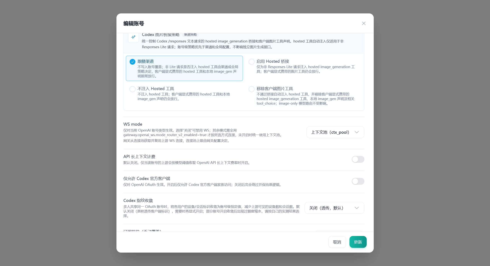
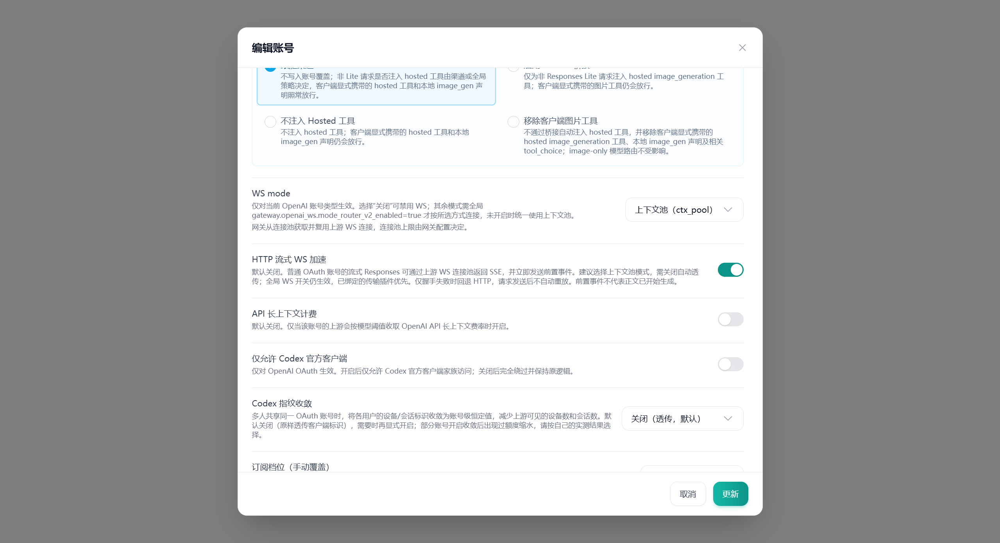

# OpenAI OAuth HTTP 流式 WS 加速

账号编辑页的「HTTP 流式 WS 加速」默认关闭。开启后，普通 OpenAI OAuth 账号的 HTTP `POST /v1/responses` 流式请求可以使用已有的上游 WebSocket v2 连接池，下游仍接收 SSE。`response.created`、`response.in_progress` 等前置事件不再等待首 token，收到后即刷出；首 token 指标仍由内容事件决定。

## 使用条件

1. 编辑普通 OpenAI OAuth 账号，将 WS mode 设为「上下文池」，关闭「自动透传」，开启「HTTP 流式 WS 加速」并保存。
2. 网关已有的 `gateway.openai_ws.enabled`、`oauth_enabled`、`responses_websockets_v2` 必须开启，账号及全局 `force_http` 不能开启。
3. 客户端使用 HTTP Responses 且 `stream: true`。非流式、`/responses/compact`、Messages 兼容桥接及携带非空 `previous_response_id` 的请求继续使用原传输。

数据库字段为 `accounts.extra.openai_oauth_ws_sse_acceleration`，仅布尔值 `true` 启用，不需要数据库迁移。连接数、超时、账号代理和会话隔离沿用已有 WS 配置。自动透传账号继续走自己的 HTTP 转发链；已绑定的 OAuth 出站传输插件优先，不会被这个开关绕过。API Key、setup-token、影子账号、Agent Identity、PAT 和 BPS 协议不由此开关切换传输。

## 错误与回退

只在 WebSocket 握手失败、尚未发送 `response.create` 时允许回退一次 HTTP。认证、权限和限流错误保留原错误处理。请求写入失败、等待首事件超时或断连都不能证明上游未执行，因此加速路径不会自动重连重放，也不会因此回退 HTTP。元数据已发出后，后续错误在当前流内结束，不拼接另一请求。

提前发出元数据意味着客户端更早收到事件，也意味着不能继续保留首 token 前的无感换请求窗口。它不保证模型生成速度提高，也不改变 token 计费。关闭账号开关即可恢复原 HTTP 路径；不必安装或执行外部插件包。

## 实现来源与验证边界

功能需求参考 `openai-ws-sse-accelerator.s2plugin` 0.2.2 的 manifest 和配置页面，使用本仓库现有 WS 转发器实现；未复制插件二进制或逆向代码。与该包声明的「首事件前失败回退」相比，本实现仅允许握手阶段回退，避免把上游尚未返回事件误判为请求尚未执行。

回归测试使用离线模拟连接，覆盖路由开关、元数据立即刷出、首 token/用量记录、握手回退和发送后的失败。测试结果不代表真实 OpenAI 网络的性能测量或生产启用状态。

## 界面验证

使用本地 Vite、Chrome 和虚构 OAuth 账号验证：修改前仅有 WS mode；修改后显示默认关闭的新开关，开启并保存时，模拟更新 API 收到布尔值 `openai_oauth_ws_sse_acceleration: true`。前端测试另覆盖重新打开和关闭后的保存行为。截图仅展示本地模拟页面，不是生产配置。

| 修改前 | 修改后（已开启） |
| --- | --- |
|  |  |
