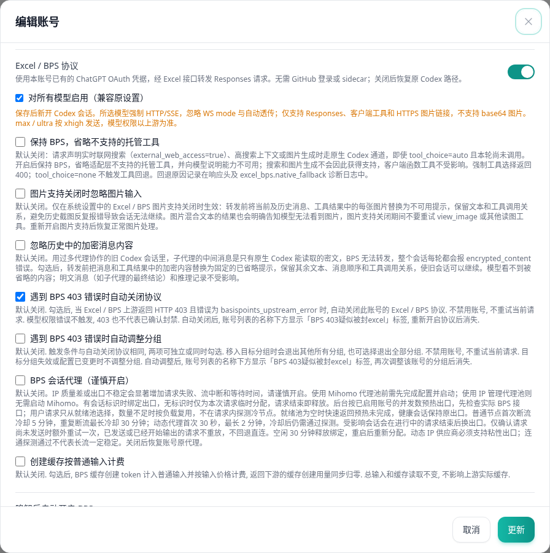
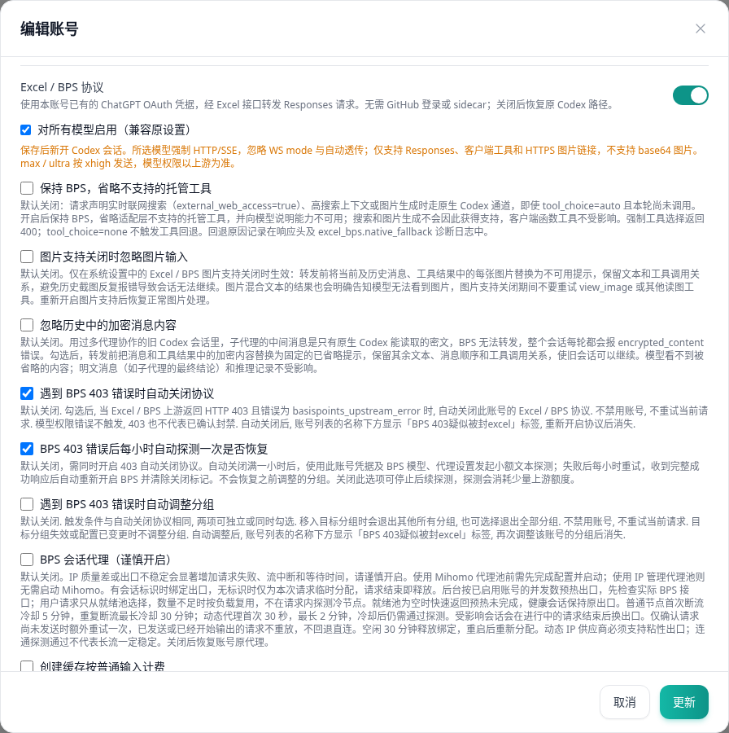
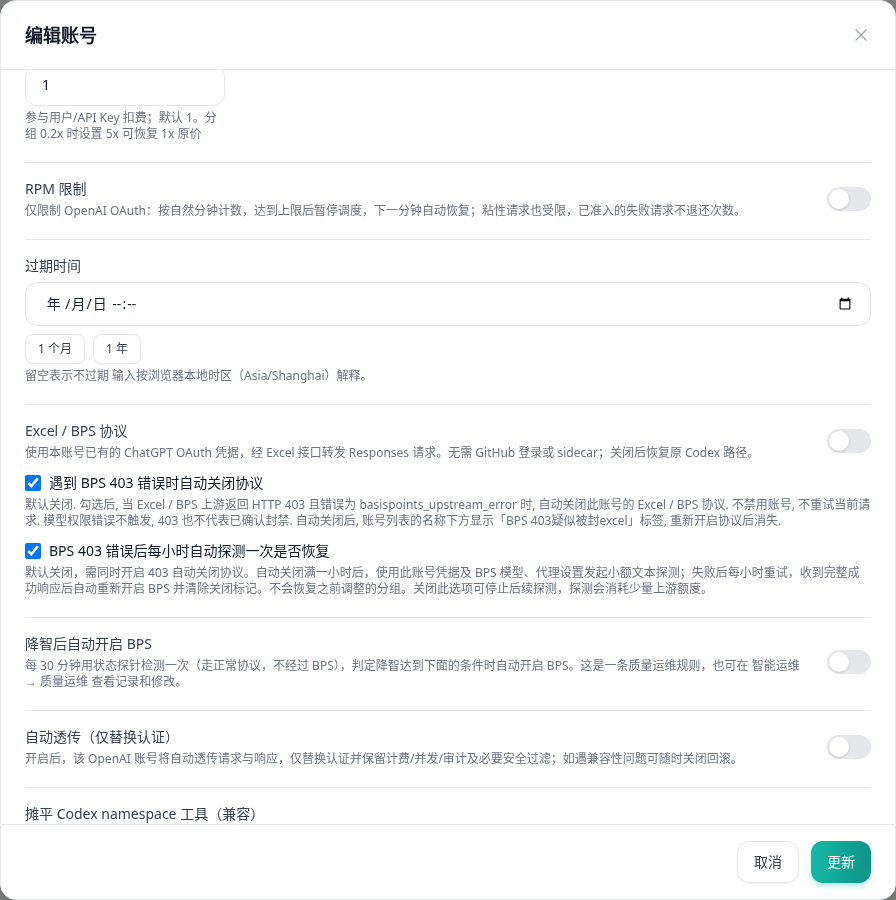
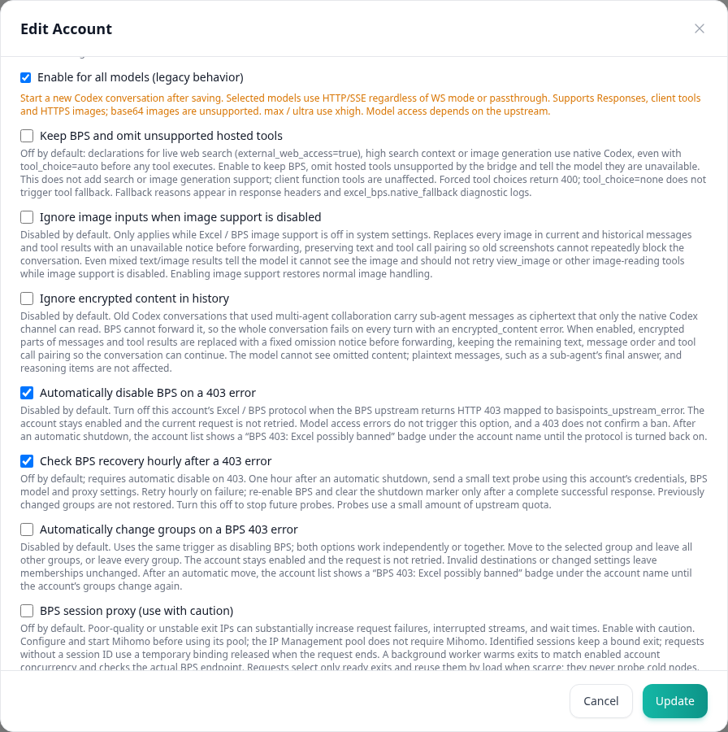

# BPS 403 每小时恢复探测：界面对照

截图日期：2026-09-28。使用真实 `EditAccountModal.vue` 组件、项目样式和语言包，在独立 Vite 页面中挂载虚构的 OpenAI OAuth 账号；管理 API 使用本地 mock，不连接生产服务或真实 BPS。浏览器：Chrome 152.0.7977.75，浅色主题。

修改前组件取自 `ranxi2001/sub2api` 的 `production` 提交 `6d7a6964b1da85c62f44bb4fc4473d4f164e4432`。其余截图使用本分支组件。截图保留真实弹窗布局，仅滚动到相关设置。

## 操作与验证

1. 打开普通 OpenAI OAuth 账号的编辑弹窗，启用 Excel / BPS 协议。
2. 在“遇到 BPS 403 错误时自动关闭协议”下方找到新增开关，确认默认未勾选。
3. 取消自动关闭协议后，恢复探测开关不可操作；重新勾选自动关闭协议后，可以勾选恢复探测。
4. 对带有服务端 403 自动关闭记录的账号打开弹窗，确认 BPS 总开关仍关闭，恢复探测选项仍可编辑。
5. 切换英文，确认新开关和说明显示英文。

上述页面操作通过 Playwright 驱动浏览器验证；保存请求和配置保留由组件 Vitest 用例覆盖。恢复探测本身由后端单元及隔离 PostgreSQL / Redis 集成测试覆盖；这些截图不代表真实 BPS 恢复验证。

## 修改前（中文）

## 修改后（中文，已勾选新开关）

## 自动关闭后仍可编辑（中文）

## 修改后（英文）

