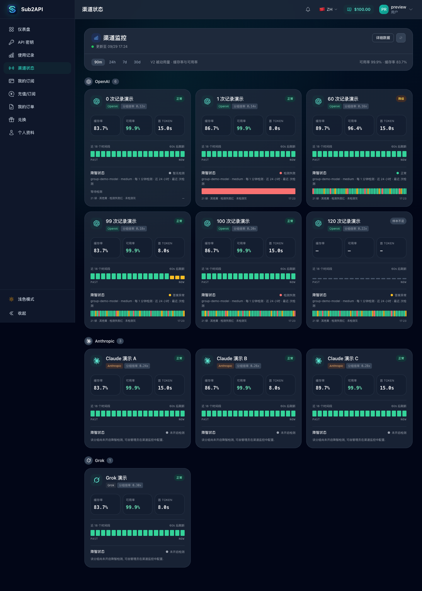
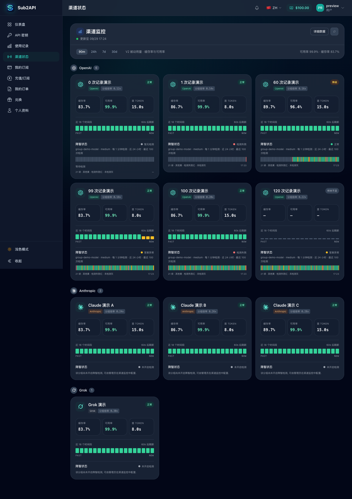
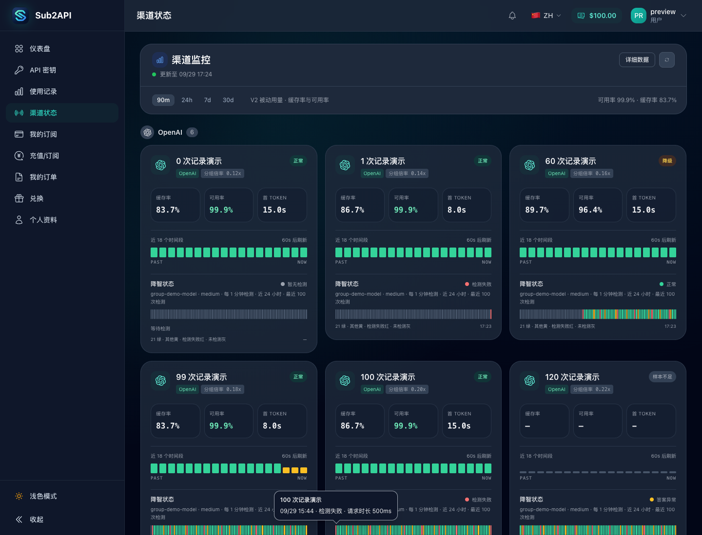
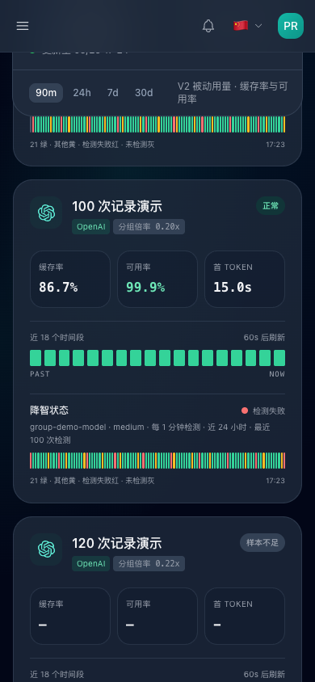

# V2 降智状态固定 100 格

## 展示规则

- 对已开启检测的分组固定显示 100 格. 从现有 24 小时保留期中, 读取当前检测配置的最近 100 条已完成记录, 按旧到新排列.
- 不足 100 条时在左侧补灰, 灰格不是检测记录, 没有虚构时间或成功状态. 完全没有记录时保留等待检测提示.
- 前端收到超过 100 条时仅展示最近 100 条. 实际色块沿用正常, 答错和检测失败颜色, 保留悬停, 键盘及手机点击详情.
- 未开启检测的分组继续显示未开启提示, 不自动创建检测或产生额外上游调用.
- 先按授权分组和当前配置过滤, 再计算每组最近 100 条, 避免旧模型或旧配置记录占用名额.
- 24 小时清理策略保持不变. 检测间隔较长, 刚启用或切换配置时, 真实记录可能不足 100 条. 已被清理的记录不会恢复.

## 验收步骤

1. 在隔离环境开启 V2 监控及分组检测, 打开 `/monitor`.
2. 分别使用 0, 1, 60, 99, 100, 120 条合成记录, 核对每个已开启分组均显示 100 格, 实际色块与左侧灰格数量正确.
3. 检查最新记录在最右侧, 超过一小时前但仍在保留期内的记录可以显示详情.
4. 在 390px 手机视口检查全部色块宽度为正且无横向溢出, 点击首尾色块确认详情未被裁切.
5. 使用隔离 PostgreSQL 检查 125 条当前配置记录和 110 条更近的旧配置记录, 确认仍取到当前配置的最近 100 条. 核对其他分组, 运行中记录及超出 24 小时记录的过滤.

## 验证边界

- 浏览器截图来自本机 Chrome 和本地 mock API, 分组, 账号及指标全部为虚构数据. 未连接生产数据库或调用真实模型.
- 改动前截图使用基线 `faf58e440` 的卡片组件, 配合模拟旧版近 60 分钟且最多 60 条的接口响应. 不是完整旧版本后端或生产复现.
- 改动后使用 100 条及不足 / 超出上限的合成响应验证布局. 数据库取数另由真实隔离 PostgreSQL 集成测试验证.

## 截图

