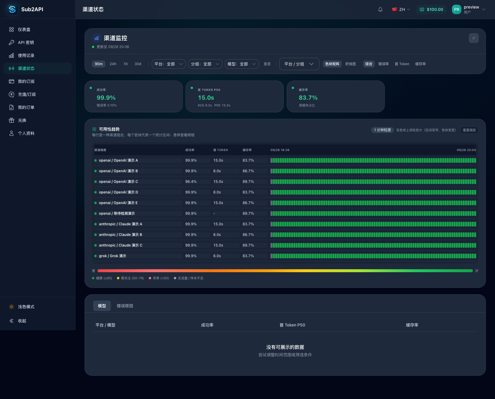
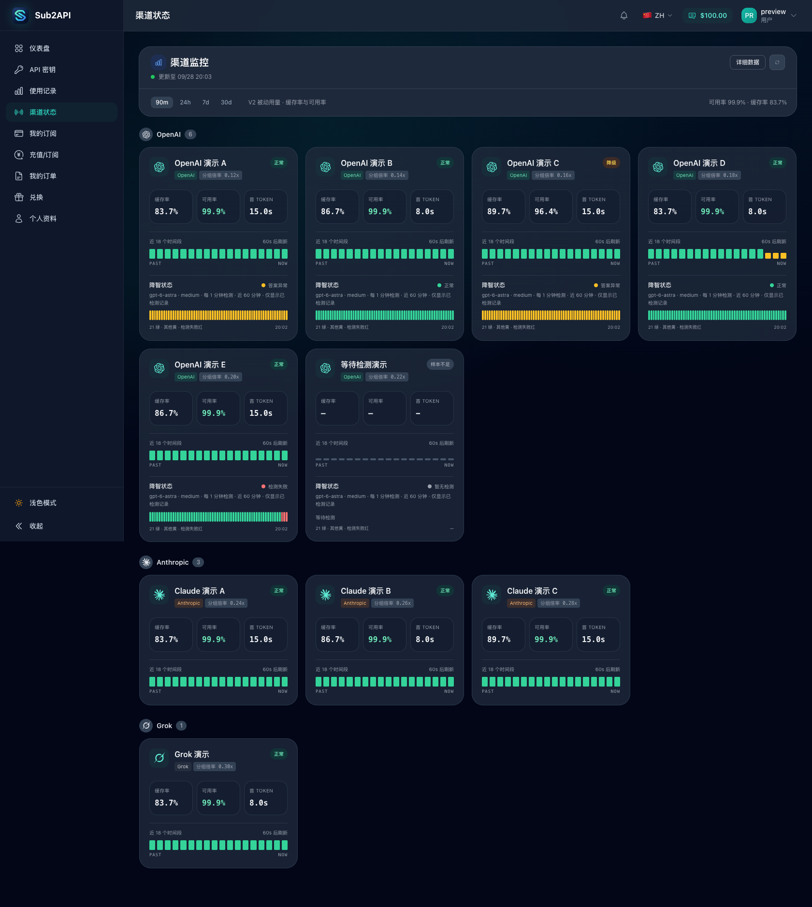
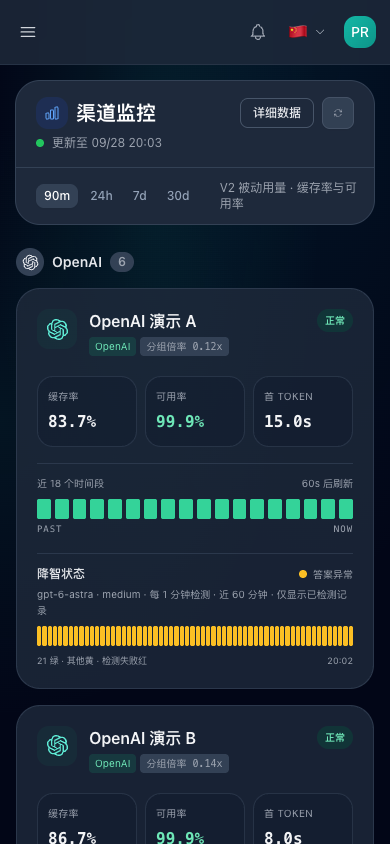
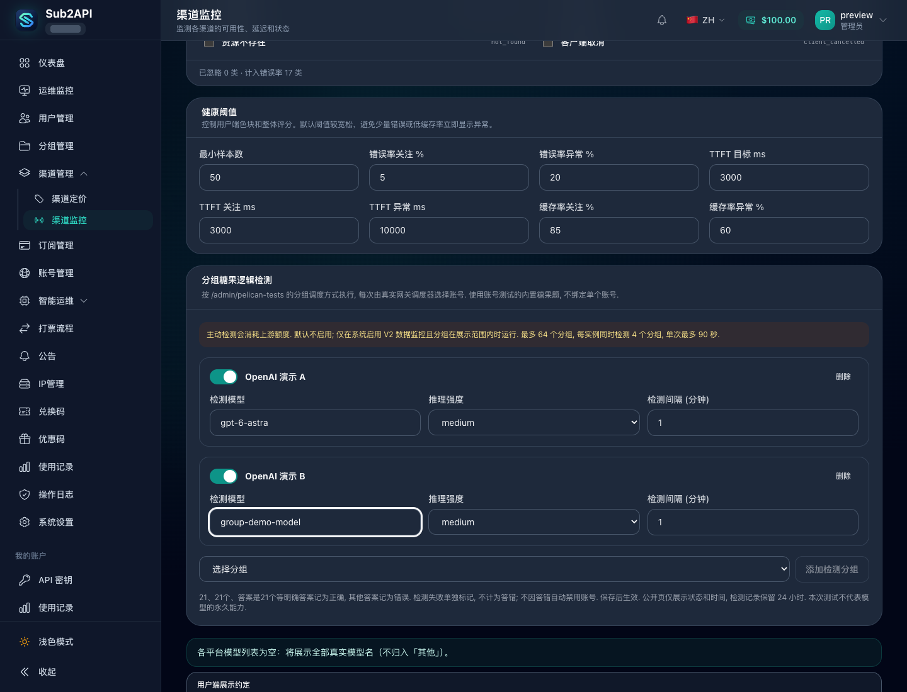

# V2 渠道卡片与分组糖果检测

## 配置与验收

1. 启用系统设置中的 V2 数据监控, 打开 `/admin/channels/monitor`.
2. 在分组糖果逻辑检测中添加分组, 填写该分组支持的模型、推理强度和分钟间隔, 保存配置.
3. 在 `/monitor` 查看按平台排列的分组卡片. 缓存率、可用率、首 Token P50 和主时间线使用真实请求的被动统计.
4. 查看配置分组的降智状态条. 每次沿用 `/admin/pelican-tests` 的网关分组调度方式选择账号, 结果归属分组.
5. 核对 `21`、`21个`、`答案是21个` 等明确答案为绿色; 错误答案为黄色; 请求失败为红色. 没有检测时显示等待, 超过间隔及容差的结果显示过期, 不补造成功记录.
6. 切换详细数据入口, 核对原有矩阵、趋势、筛选及明细仍可使用.

## 运行边界

- 默认不添加检测分组. 主动检测消耗上游额度, 不写入用户的计费用量或被动监控统计.
- 最多配置 64 个分组, 每实例同时执行最多 4 个检测, 单次最多 90 秒. 间隔是调度周期, 并发饱和或上游响应缓慢可能延后完成时间.
- 页面刷新周期取原配置与可见分组最短检测间隔的较小值, 最少 60 秒; 数据初始化阶段保持 10 秒刷新. 例如原配置 300 秒、分组每分钟检测时, 页面每 60 秒刷新, 避免持有旧结果而误报过期.
- 正式回答出现后保留该次判分, 不因答错切换其他账号取得正确答案. 不会因答错自动禁用账号、移出分组或恢复账号. 上游鉴权失败、限流和 BPS 错误仍沿用账号测试与网关的原有健康处理.
- 保存状态、时间、耗时、最多 512 字符的答案摘要和固定原因码. 管理员可以在检测条悬停查看摘要, 普通用户不收到摘要、错误正文、账号信息或凭据.
- 数据库保留 24 小时, 页面只展示近 60 分钟内最多 60 次已完成检测. 修改模型或推理强度后不混用旧配置的结果.
- 同一分组具有数据库运行占用及时间窗口唯一约束. 超过 3 分钟未结束的占用标记为中断, 迟到的执行结果不能覆盖中断记录.
- 关闭分组检测、V2 开关或切回 V1 后停止新检测. 已发出的请求按超时收尾, 历史记录按保留策略清理.

## 本地截图验证

2026-09-28, 使用本机 Chrome 和本地 Vite 页面, 通过合成接口数据检查渲染与表单交互. 所有分组名、账号、额度和指标均为虚构值. 未连接生产数据库, 未发出真实上游模型请求. 截图不是线上检测结果或对模型能力的证明.

- 桌面: 1680×1120 视口, 检查 10 个按平台排列的分组, 正确/错误/检测失败/无记录状态, 以及详细数据视图切换.
- 改动前对照: 加载基线 `62ac3a5dd` 的 `ChannelStatusV2View.vue` 页面组件, 使用相同结构的合成数据渲染原矩阵布局; 不是生产实例截图或完整旧版本端到端验证.
- 刷新联动: 合成配置为 300 秒页面刷新、1 分钟分组检测, 确认实际倒计时不超过 60 秒.
- 手机: 390×844 视口, 检查卡片换行且页面无横向溢出.
- 管理端: 1440×1100 视口, 添加分组并保存模型、推理强度和检测间隔, 核对提交参数为 `group_id`, 不包含 `account_id`. 保存请求仅发送给本地 mock.

