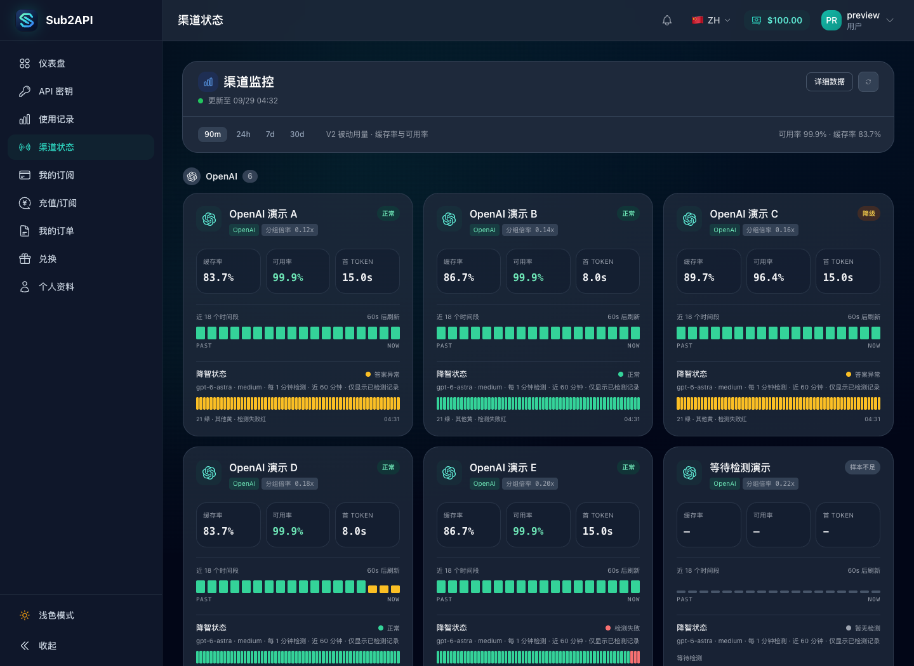
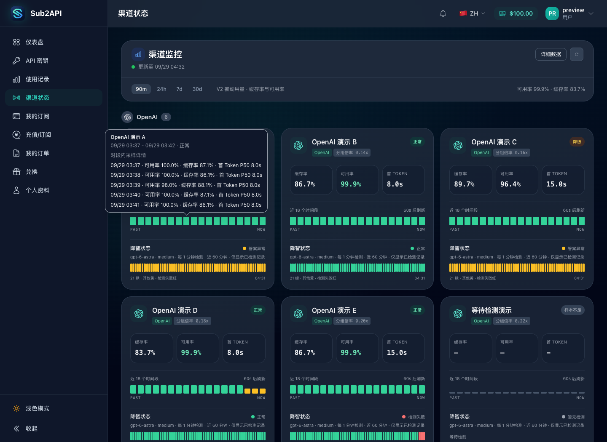
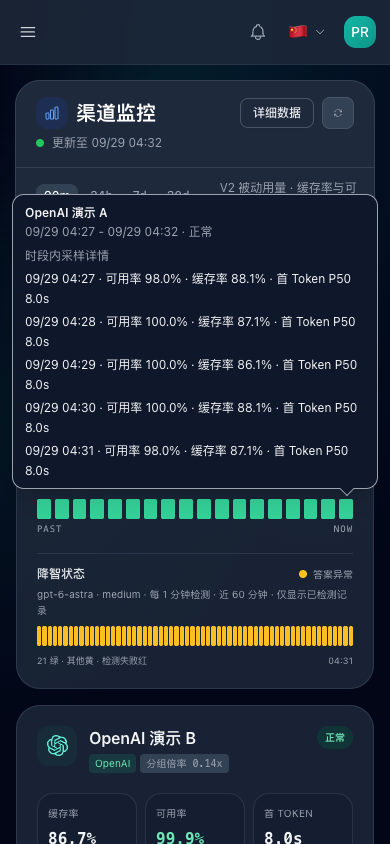
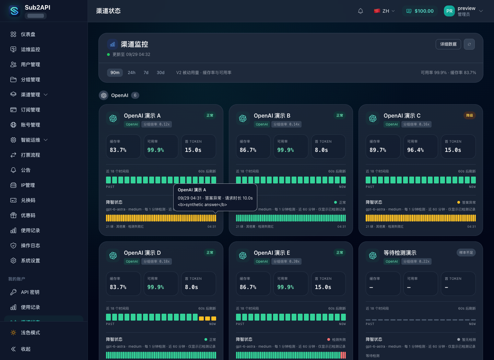
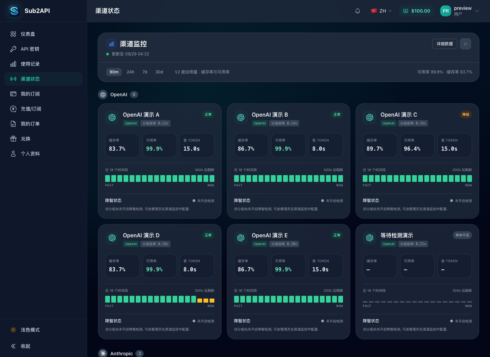
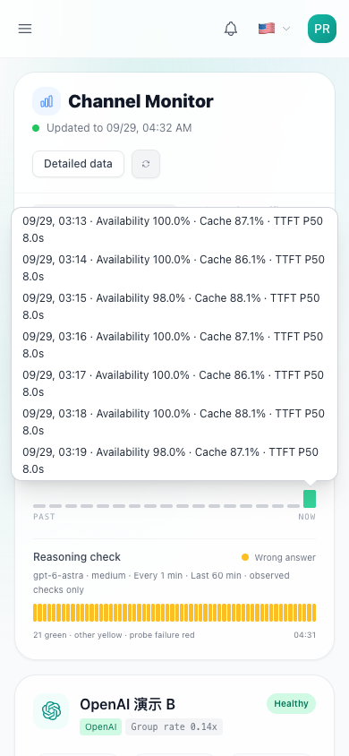

# V2 监控悬停详情与降智状态展示

## 使用与验收

1. 启用 V2 渠道监控, 打开 `/monitor`.
2. 将鼠标放在流量时间线色块上, 核对时段, 采样时间, 可用率, 缓存率及首 Token P50. 空时段应显示无流量, 不显示虚假的 100% 可用率.
3. 将鼠标放在降智检测条上, 核对检测时间, 结果和请求时长. 仅展示接口已授权返回的答案摘要, 将摘要作为纯文本显示.
4. 使用 Tab 聚焦或在手机点击色块, 确认详情可打开; 使用 Escape, 点击外部或离开触发区域后确认可关闭. 滚动长详情时保持打开, 页面滚动或窗口改变时关闭.
5. 检查靠近屏幕左右边缘的色块, 确认浮层完整显示.
6. 检查未配置或未开启检测的分组, 确认仍有降智状态区域且显示未开启检测. 已开启但没有结果时显示等待检测, 不生成虚构检测条.

## 数据边界

- 时间线仍由原来的 18 个时间段组成, 每段沿用既有最差健康状态. 一个时间段内可能包含多个原始时间桶, 详情逐条展示真实指标. 不使用已脱敏的请求数重算百分比, 不把多个 P50 合并成新的 P50.
- 不新增接口, 不改变分组访问范围, 不展示绝对请求数或 Token 总量. 答案摘要继续由后端决定是否向调用者提供.
- 未开启检测时仅显示提示, 不自动启用检测或发出付费模型请求. 配置仍由管理员在 `/admin/channels/monitor` 完成.
- 接口未返回 `candy` 时, 原页面通过条件渲染隐藏整个区域. 本次保留该区域并显示未开启状态, 与已开启但结果为空的等待状态区分.

## 验证范围

- 基线 `468061e08` 的卡片组件在同一合成 API 环境中验证: 只有原生 title, 未返回 `candy` 的分组不显示降智区域. 这不是完整旧版本端到端验证.
- 本机 Chrome, 桌面 1440x1050 和手机 390x844. 检查鼠标移动, 键盘, 点击, 浮层边界, 空时段, 配置缺失和长内容内部滚动.
- 中文暗色和英文浅色界面均进行浏览器验证. 长内容场景使用合成密集时间桶, 不代表线上 30 天接口的实际桶密度.
- 所有截图均使用虚构分组, 账号和指标, 不包含生产请求或真实凭据. 未连接生产数据库或调用上游模型.

## 截图

改动前, 只有原生 title:

流量详情逐条展示原始采样:

手机点击右边缘色块:

管理员已获授权的检测摘要按纯文本显示:

所有分组均未开启检测时仍保留降智状态区域:

英文浅色界面的长详情内部滚动:

