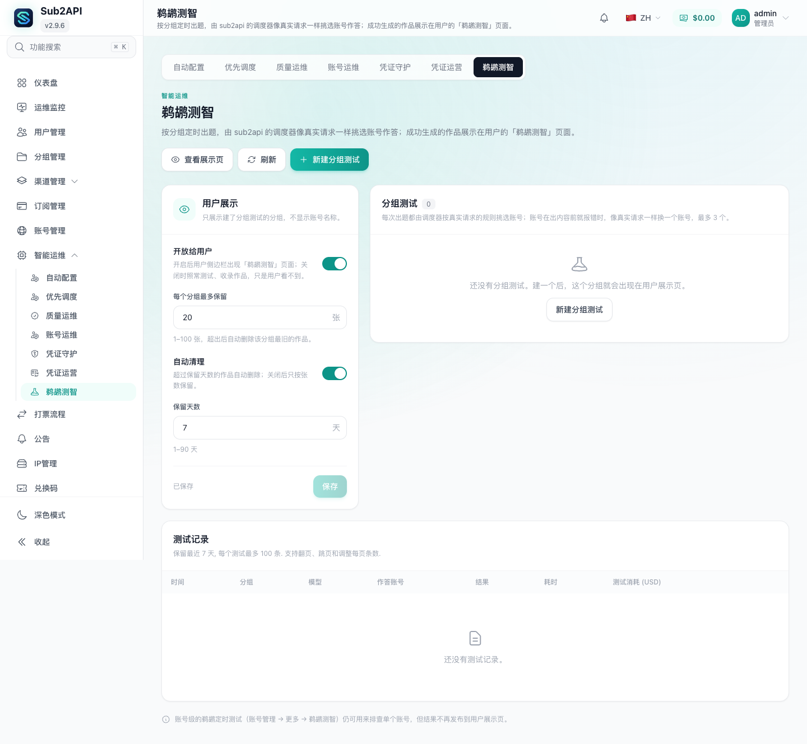
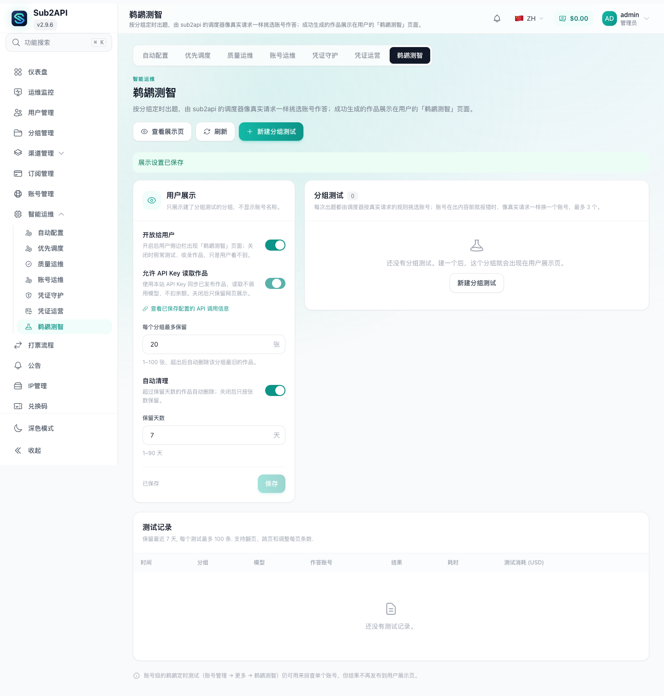
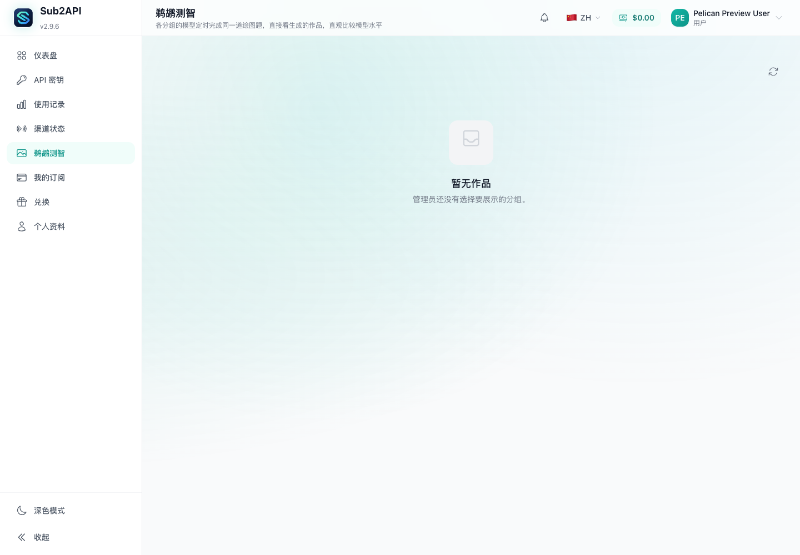
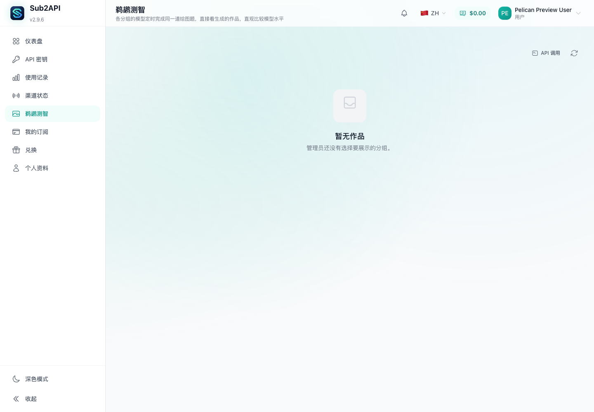
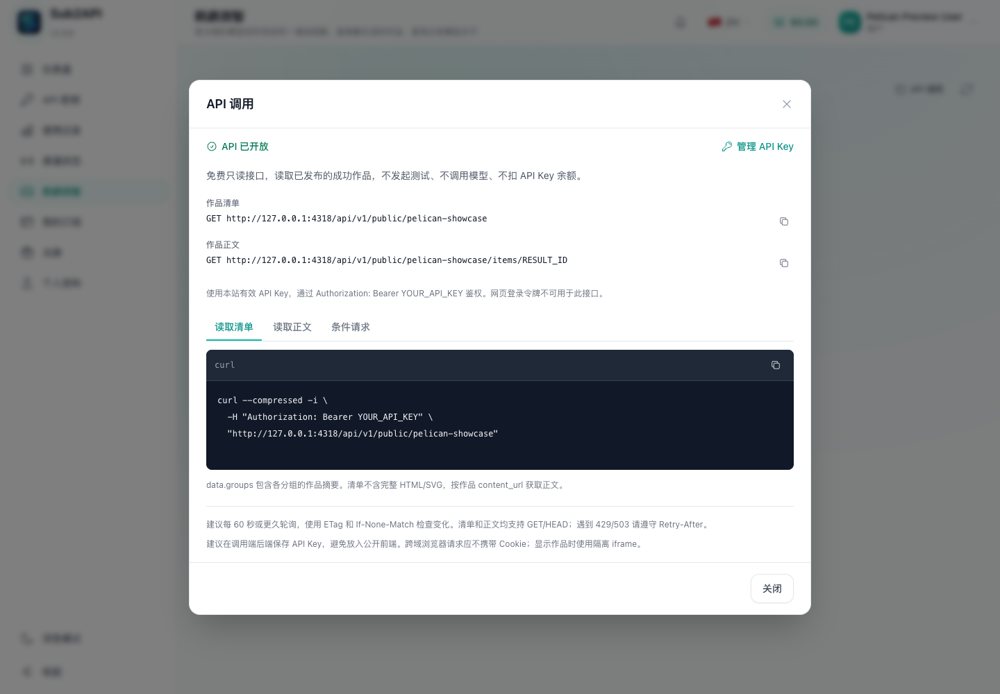
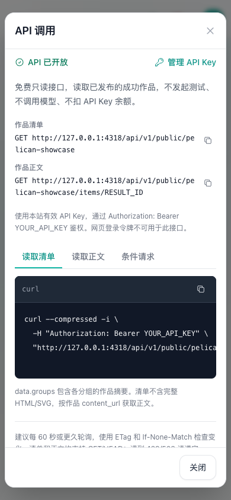

# 鹈鹕作品 API 界面验收截图

截图日期：2026-10-02。通过 Playwright 控制本机 Chrome，在隔离测试实例中使用虚构用户采集；没有上游 AI 账号、真实作品、邮箱、密码或实际 API Key。

前端对照基线为 `origin/production` 的 `bf9405e4a`，修改后源码为 `9d7b5cd5d`。前后截图共用本次实现的隔离后端，以便保持相同的虚构数据；“修改前”用于对照原有前端界面，不代表旧后端行为的 HTTP 验证。

桌面视口为 1440 × 1000，移动视口为 390 × 844；桌面页面截图使用全页模式，弹窗截图禁用动画。浏览器使用中文界面，中英文文案由 i18n 完整性测试覆盖。地址中的 `127.0.0.1:4318` 是本地测试前端，由弹窗按当前面板 origin 生成；生产环境会使用其实际面板地址。

## 管理端前后对照

入口：智能运维 → 鹈鹕测智 → 用户展示。测试数据开启用户展示，没有配置分组测试。

修改前只有网页展示、保留数量及自动清理配置。修改后增加独立的“允许 API Key 读取作品”开关和已保存配置的 API 调用信息入口。

浏览器验收步骤：关闭 API 读取 → 保存 → 刷新 → 确认 API 开关仍关闭且用户展示仍开启 → 重新开启并保存。开关保存与刷新后的状态已通过实际页面操作验证。

## 用户端前后对照

入口：鹈鹕测智。虚构用户余额为零；没有发布作品时仍可查看 API 调用说明。

## API 调用弹窗

点击“API 调用”，可查看当前开放状态、清单和正文地址、Bearer 鉴权、三种 curl 示例、复制按钮和 API Key 管理入口。没有作品时正文 ID 显示 `RESULT_ID`；示例只显示 `YOUR_API_KEY` 和 `YOUR_ETAG` 占位符。

浏览器验收步骤：分别切换“读取清单”“读取正文”“条件请求”，确认示例内容对应端点及完整 ETag 占位符；三种示例代码区高度均为 128px。桌面和移动端没有页面脚本错误或横向溢出。图片展示中文界面，未进行英文界面的浏览器截图验收。
