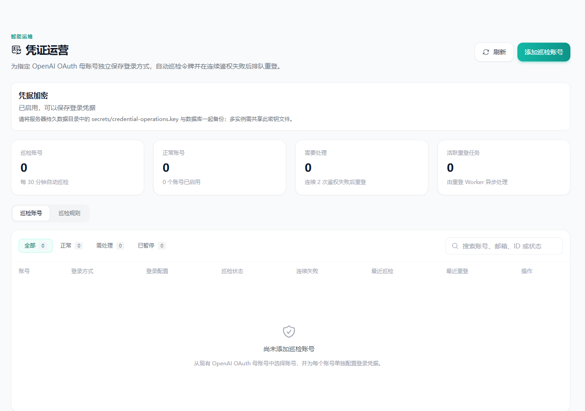
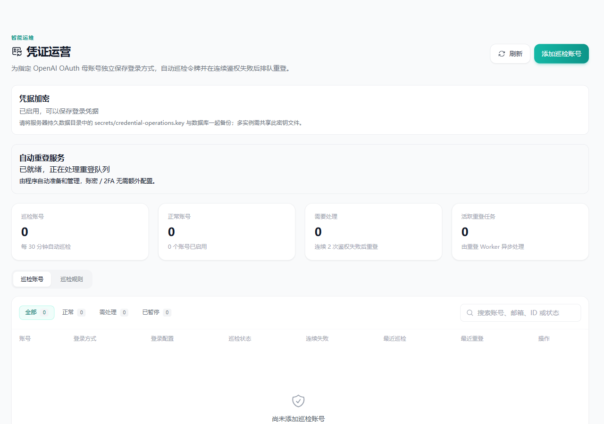
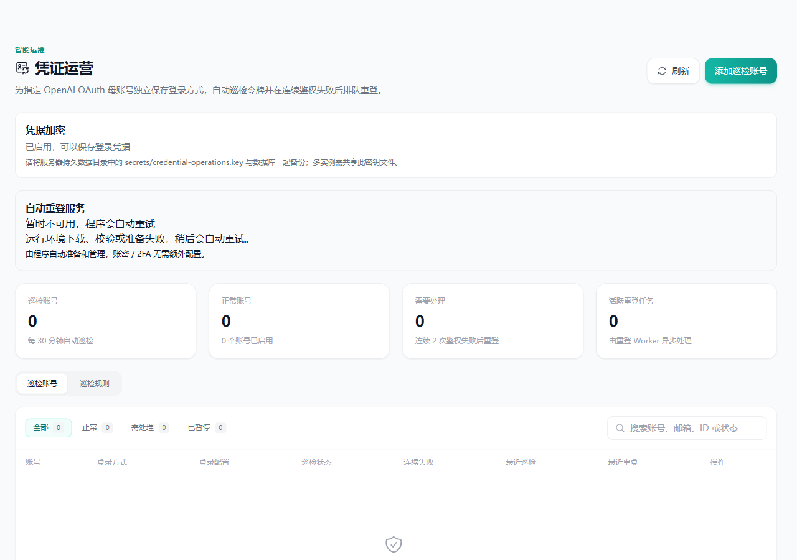
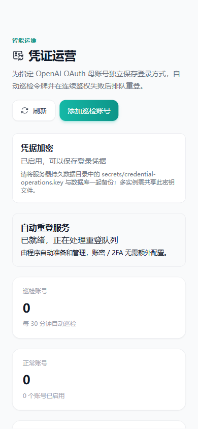

# 自动重登服务状态

截图使用当前 TokenGuardV2View.vue 和本地合成 API；AppLayout 和 SmartOpsNav 替换为空壳，以便聚焦页面内容。无账号、令牌或生产连接。密钥状态固定为 configured/local_file。

- before.png：模拟原接口没有 worker 字段的展示，不声称是旧版本完整运行环境。
- running.png：内置重登服务就绪。
- unavailable.png：运行环境准备失败，独立显示原因和自动重试提示。
- mobile.png：390px 视口，页面 scrollWidth=390，无横向溢出。

浏览器为独立 Chrome profile，使用 CDP 渲染截图。桌面视口 1280×900，移动视口 390×844；不代表生产自动下载或真实登录验收。

