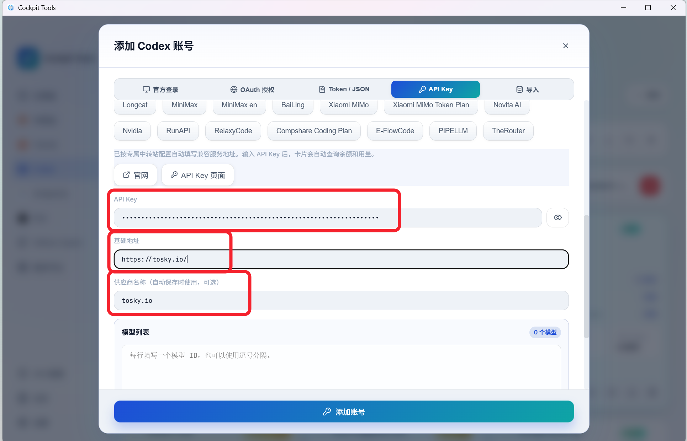
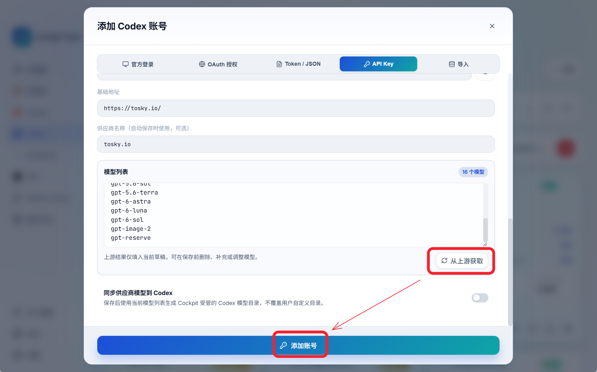
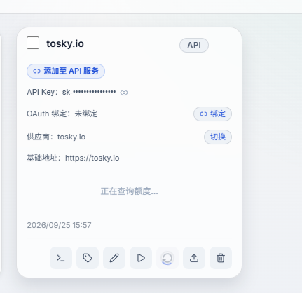
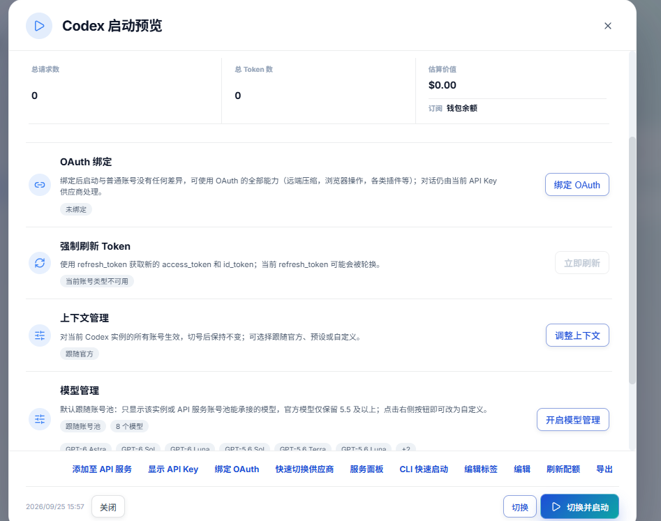

# 新人入门：使用 Sub2API 接入 Codex

适合已经托管账号，或已经搭好 Sub2API、但还不知道如何在电脑上使用的新用户。本文根据 9 月 26 日的群聊操作记录整理，以 Cockpit Tools 配置 Codex 为例。

**后台测试通过后，还需要创建 Sub2API API Key，并让客户端使用这把 Key 和对应的服务地址。** 完成这一步，客户端请求才会走你配置的 Sub2API。

如果还没搭建服务，先看 [Sub2API 部署与后台配置入门](新人入门.md)。使用托管服务的用户可以直接从下面开始。

## 一、先分清这几个东西

| 名称 | 用来做什么 | 在哪里使用 |
| --- | --- | --- |
| Sub2API 网站账号 | 登录网站、管理自己的 API Key、查看使用记录 | 浏览器 |
| 上游账号 | 为 Sub2API 提供实际的模型调用能力 | 由自己或管理员在 Sub2API 后台配置 |
| Sub2API API Key | 允许客户端通过 Sub2API 发起请求 | 填进 Cockpit Tools 的「API Key」 |
| 基础地址（Base URL） | 告诉客户端请求发到哪个服务 | 填进 Cockpit Tools 的「基础地址」 |
| 分组 | 决定这把 Key 使用哪组账号和服务配置 | 创建 Key 时选择或由管理员安排 |
| Cockpit Tools | 管理、切换并启动 Codex 的工具 | 安装在你使用 Codex 的电脑上 |

网站登录密码、上游账号凭据、Sub2API API Key 各有用途，填写时不要混用。

请求经过的路径是：

```text
电脑上的 Codex
    ↓ 使用 Sub2API API Key
你的 Sub2API 服务（托管平台或自建站点）
    ↓ 按分组和账号配置转发
上游模型
```

## 二、准备好托管或自建账号

### 使用托管服务

1. 在管理员提供的 Sub2API 网站注册账号。原记录使用的是 `https://tosky.io/`，实际入口以管理员提供的地址为准。
2. 向管理员说明你的网站用户标识，方便分配权限；区分网站账号和准备托管的上游账号。
3. 按约定完成上游账号接入。原记录讨论了 OAuth 授权和 JSON 导入两种方式，选择管理员支持的方式即可。
4. 等管理员确认账号测试通过、对应分组已可用，再创建 API Key。

OAuth 授权尽量由本人完成。账号 JSON 可能包含登录凭据，不要发到群聊，也不要公开密码、验证码或授权回调内容。托管费用、赞助抵扣和服务范围单独向管理员确认，聊天中的个别约定不作为统一规则。

### 已经自建 Sub2API

先确认后台已添加上游账号，并完成分组配置和账号测试。若这些已经通过，直接继续创建 API Key，无需为了接入客户端重新托管一次。

如果要使用本 fork 的 Excel / BPS 等能力，先按 [后台配置入门](新人入门.md) 完成对应账号和模型设置。客户端使用哪条路径，仍取决于后台实际配置。

## 三、在 Sub2API 创建 API Key

1. 用自己的网站账号登录 Sub2API。
2. 找到「API Key」或「API 密钥」页面，点击创建；不同版本的菜单名称可能略有区别。
3. 填一个容易辨认的名称，例如「我的电脑-Codex」。
4. 选择管理员分配的分组；自建用户选择已配置好账号和模型的分组。如果看不到目标分组，先检查分组权限。
5. 按页面需要设置有效期、额度等选项并保存。
6. 复制生成的 Key，保存在自己的密码管理器等安全位置，后面填到客户端。

继续前，请准备好这三项：

| 必需信息 | 从哪里取得 |
| --- | --- |
| API Key | 当前 Sub2API 网站的密钥页面 |
| 基础地址 | 站点接入说明或管理员 |
| 可用模型 | 站点说明、管理员，或后面从服务获取的模型列表 |

**Key 和基础地址必须来自同一个站点。** 托管平台的 Key 不能直接拿到自己的 Sub2API 上使用。

## 四、用 Cockpit Tools 添加 API 配置

### 1. 下载并打开工具

从 [Cockpit Tools 项目](https://github.com/jlcodes99/cockpit-tools) 的 [Releases](https://github.com/jlcodes99/cockpit-tools/releases) 下载适合自己系统的安装包。项目提供 macOS、Windows 和 Linux 版本。

在电脑上准备好要使用的 Codex 客户端，再打开 Cockpit Tools。下面的按钮名称以原记录截图为例；版本变化时，按同名或对应功能操作。

### 2. 进入 Codex，选择 API Key

1. 点击左侧「Codex」。
2. 点击右上角「＋」新建账号。
3. 在「添加 Codex 账号」窗口选择「API Key」。
4. 填入以下内容：

| 字段 | 填写内容 |
| --- | --- |
| API Key | 刚刚在 Sub2API 创建的 Key |
| 基础地址 | 当前站点提供的接入地址 |
| 供应商名称 | 自己能认出的名称，例如「我的 Sub2API」 |

原记录在这个窗口填写的基础地址是 `https://tosky.io/`。自建用户替换为自己的服务地址。**是否带 `/v1` 应按站点和当前工具的接入说明填写**，不要把网页后台路径填进去，也不要重复拼接 `/v1`。



这里选择 API Key 接入。前面给 Sub2API 添加上游账号时做的 OAuth 授权，与这一步是两个环节。

### 3. 获取模型并保存

1. 向下找到「模型列表」。
2. 点击「从上游获取」。这里的“上游”是你刚填入的 Sub2API 服务地址。
3. 检查是否获取到模型。不要照抄截图中的完整列表，可用模型以自己的站点和分组为准。
4. 点击「添加账号」保存。



获取到列表只说明模型发现这一步成功；某个模型是否能正常调用，还要通过实际请求确认。若获取失败，先检查地址、Key、网络和分组权限。

## 五、切换并启动 Codex

添加成功后，Codex 页面会出现一张 API 账号卡片。



1. 找到刚添加的账号卡片。
2. 点击卡片底部的三角形「运行」按钮。
3. 在启动预览中确认当前配置。
4. 点击右下角「切换并启动」。



原记录中的基础 API 对话流程跳过了「绑定 OAuth」。先完成 API 调用即可；如果后续某项客户端功能要求额外登录，再按该功能说明处理。

**仅添加账号卡片还不够，要完成「切换并启动」。** 已经打开的旧窗口可能仍在使用原配置，测试时使用这次启动的窗口。若提示找不到客户端，按工具提示检查 Codex 安装情况和启动路径。

Codex 支持配置自定义服务提供商及其基础地址、认证信息，相关原理见 [OpenAI 官方配置文档](https://developers.openai.com/codex/config-advanced/)。本文使用 Cockpit Tools 界面完成配置，无需新手手动编辑配置文件。

## 六、确认请求真的走了 Sub2API

1. 在刚启动的 Codex 中选择当前分组支持的模型，开始一个新会话。
2. 先发送一句简单请求，例如「请只回复：连接成功」。
3. 回到 Sub2API 的使用记录或请求日志页面，检查相同时间是否有这把 Key 的调用记录；没有查看权限时请管理员核对。
4. 确认能收到回复，且记录里的模型、分组符合预期，再开始正常使用。

后台账号测试通过，说明后台测试的路径可用；客户端收到回复，并能在 Sub2API 查到对应记录，才能确认客户端也已接通。

原聊天还用了糖果题做质量测试。先把连接跑通，再做固定模型、固定推理强度的对照测试；不要把一次答对或某个固定答案当作“永不降智”的保证。

## 七、常见问题

### 我已经在后台测通了，为什么电脑上还没变化？

继续完成「创建 API Key → 添加 API 配置 → 切换并启动」。后台配置不会自动修改电脑上现有的登录方式和服务地址。

### 自建和托管，客户端操作一样吗？

这套接入步骤相同。区别在于使用哪个站点的地址、Key 和分组。准备从托管切回自建时，为自建站点单独创建一张 API 配置卡片，再切换并启动。

### 需要把网站密码或上游账号密码填进 API Key 吗？

不需要。这里只填 Sub2API 密钥页面生成的 Key。

### 模型列表为空，或者请求报错怎么办？

| 现象 | 先检查什么 |
| --- | --- |
| 获取模型失败、列表为空 | 基础地址是否正确，Key 是否完整，分组是否可用 |
| `401` | Key 是否填错、失效或已被删除 |
| `403` | 用户、Key、分组及模型权限是否满足要求 |
| `404` | 地址是否误带后台页面路径，是否重复或遗漏接口前缀 |
| `429` | 当前站点或上游的额度、并发和速率限制 |
| `503` | 对应分组是否有可用账号，请管理员结合日志检查 |
| 能回复，但 Sub2API 没有对应记录 | 是否仍在使用旧窗口、旧配置或原来的登录方式 |

这些是排查起点，具体原因以返回的错误信息和服务日志为准。求助时提供错误时间、客户端版本、模型名、错误码和脱敏截图即可；不要贴完整 Key、账号 JSON 或验证码。

## 完成检查

- [ ] Sub2API 上游账号和分组已准备好。
- [ ] 已在正确站点创建 API Key。
- [ ] Cockpit Tools 已填入配套的 Key 和基础地址。
- [ ] 已获取或确认可用模型，并保存账号。
- [ ] 已点击「切换并启动」。
- [ ] 客户端收到回复，Sub2API 中能查到对应调用记录。

> 本文保留原操作记录中已遮挡密钥的配置截图，不收录私人账号、验证码及付款对话。截图中的站点、模型和界面状态仅用于说明操作，不代表当前服务承诺。
