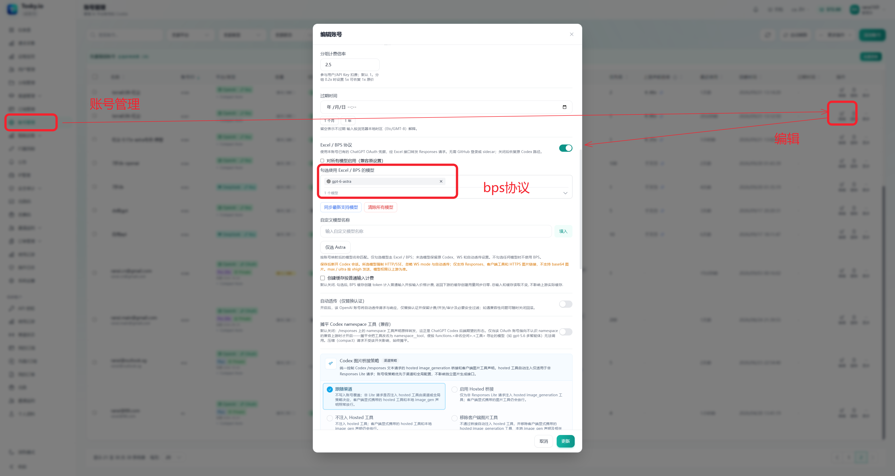
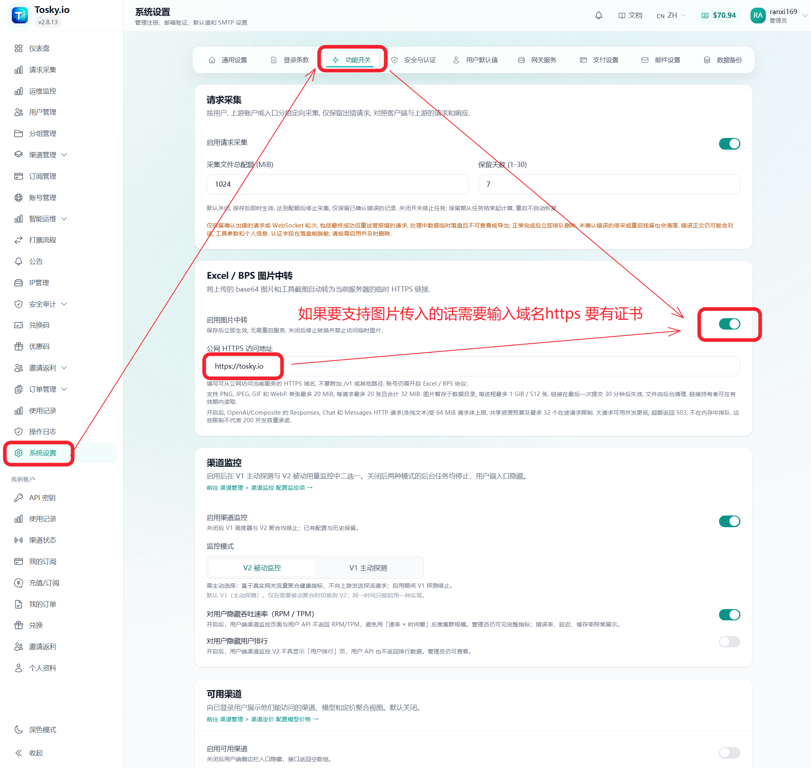

# Sub2API 新人入门

本文面向第一次部署 Sub2API，或已经部署官方版、准备切换到本 fork 的用户。当前示例版本为 `v0.2.81`。

## 1. 选择部署位置

正式服务建议部署在 Linux VPS。Mac、Windows、Linux 电脑作为客户端访问 VPS 网关即可；本机部署适合测试，通常只供本机或局域网使用。

## 2. 安装或替换为 fork 版

在 VPS 的 Linux 终端执行：

```bash
curl -fsSL https://raw.githubusercontent.com/ziyue67/sub2api/v0.2.81/deploy/install.sh \
  | sudo bash -s -- install -v v0.2.81
```

也可以使用 Docker 镜像：

```bash
docker pull ziyue67/sub2api:0.2.81
docker pull ghcr.io/ziyue67/sub2api:0.2.81
```

只执行 `docker pull` 不会启动服务，Docker 的数据目录、数据库、端口映射和启动步骤请参阅[部署文档](../deploy/README.md)。

如果 VPS 已经安装官方版，可以按同一安装流程替换二进制。替换前请备份数据库和配置，确认数据目录、端口和服务名一致；不要同时启动两个占用同一端口的版本，也不要删除原数据目录。升级后在后台确认版本为 `v0.2.81`，并检查账号、分组、渠道和历史数据。

## 3. 首次配置

1. 为 VPS 配置域名和 HTTPS。
2. 在后台创建用户、分组和 API Key。
3. 在「账号管理」中添加上游账号。
4. 先用一个账号完成测试，再批量配置。

## 4. 开启 Excel / BPS

BPS 按账号和模型启用：

1. 进入「账号管理」，编辑 OpenAI OAuth / ChatGPT 账号。
2. 打开「Excel / BPS 协议」。
3. 在模型选择框中勾选需要走 BPS 的模型，例如 `gpt-6-astra`。
4. 点击「更新」保存。



账号较多时，可以使用 `v0.2.81` 的批量设置功能，统一修改协议开关和模型范围。建议先用少量账号验证。

BPS 主要面向支持的 OpenAI OAuth / ChatGPT 账号，不是通用的 Claude 增强开关。未勾选的模型继续走原有 Codex 路径；BPS 不会自动提升账号权限、额度或模型可用范围。界面中的 `Max` 可能是网关到上游的推理等级映射，不能理解为上游一定存在独立的 Max 档位，也不能据此保证模型不会降智。

## 5. 780 / 292 打票

只使用 Excel / BPS 时，一般不需要额外配置 780 或 292 打票。它们属于独立的 Codex 票据和路由能力。

明确使用 Codex 打票流程时，再进入「系统设置 → 网关 → Codex 设置」配置采票代理、协议和模型。采票协议应与实际业务协议匹配，不要为了启用 BPS 修改打票端口或代理。

## 6. 降智运维与糖果题

“降智”是账号、路由、上游限制和请求配置共同影响的结果，不是一个开关就能永久解决。可以在「降智运维」中为账号配置测试题、预期答案、测试模型、推理强度、Cron 和每轮次数，再到「运营记录」查看回答原文、判题理由和通过次数。

使用内置糖果题时，按当前页面配置校验答案；历史示例答案为 `21`，不要把它当成所有题目或版本的固定值。一次网络超时或请求失败不足以判定账号降智，确认失败后再考虑移出分组或暂停调度。质量检测会产生真实模型调用，结果只代表当前题目和配置下的表现。

## 7. 图片中转

需要让 Excel / BPS 处理图片或工具截图时，进入「系统设置 → 功能开关」，按需开启「Excel / BPS 图片中转」，并填写有有效证书、可从公网 HTTPS 访问的域名。没有图片需求时可以保持关闭。



不要填写 `127.0.0.1`、内网地址或无证书的 HTTP 地址。上传内容可能包含用户数据，域名和日志应按实际安全要求保护。

## 8. 客户端接入

Mac、Windows、Linux 客户端只需使用 VPS 网关的 OpenAI 兼容 Base URL 和 Sub2API API Key，不需要重复部署服务。Base URL、路径和可用模型以后台渠道配置和部署文档为准。

## 常见问题

### 已部署官方版，可以直接替换吗？

可以，但先备份数据库和配置，确认数据目录、端口和服务名一致。升级后核对版本、账号数据和一条实际请求。

### 只打开 BPS 开关够吗？

还要在账号编辑页选择具体模型并保存。未选择的模型不会走 BPS。

### Claude 反代有特别增强吗？

本 fork 的相关说明主要围绕 OpenAI OAuth / Codex 和 Excel / BPS。Claude 可用性应按实际渠道、账号和上游协议单独测试，不能由 BPS 配置推断。

### BPS 请求失败怎么办？

先做一次关闭 BPS 的对照请求，再检查账号状态、模型限制、分组权限、渠道定价和服务日志错误码。不要在群里发送 Token、Cookie、Recovery Ticket 或完整请求正文。

## 安全提醒

- 管理后台、API Key、OAuth 凭据、Cookie、代理订阅 URL 和 Recovery Ticket 都是敏感信息。
- 不要把真实凭据写入命令历史、截图、Git 或群聊。
- 生产升级前备份数据库；升级后检查服务状态和实际请求。

相关功能说明：[Excel / BPS](excel-bps.md)、[账号质量运维](account-quality-operations.md)、[原生 780 采票](codex-780-native-mint.md)。
